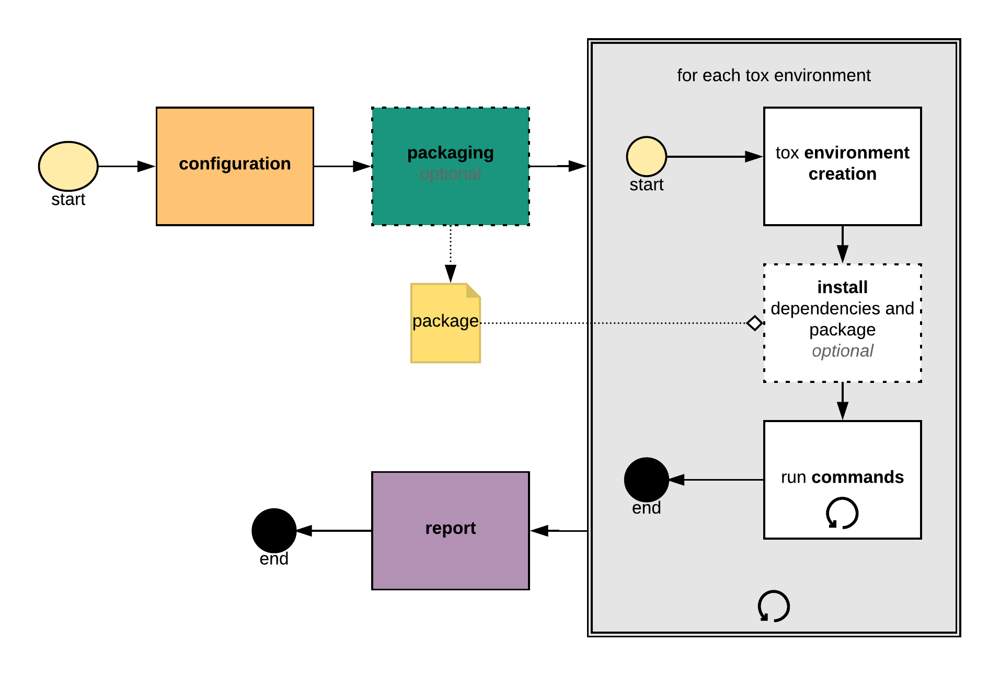

Welcome to the tox automation project
===============================================

Vision: standardize testing in Python
---------------------------------------------

``tox`` aims to automate and standardize testing in Python.  It is part
of a larger vision of easing the packaging, testing and release process
of Python software.

What is tox?
--------------------

tox is a generic virtualenv_ management and test command line tool you can use for:

* checking that your package installs correctly with different Python versions and
  interpreters

* running your tests in each of the environments, configuring your test tool of choice

* acting as a frontend to Continuous Integration servers, greatly
  reducing boilerplate and merging CI and shell-based testing.

Basic example
-----------------

First, install ``tox`` with ``pip install tox``.
Then put basic information about your project and the test environments you
want your project to run in into a ``tox.ini`` file residing
right next to your ``setup.py`` file:

.. code-block:: ini

    # content of: tox.ini , put in same dir as setup.py
    [tox]
    envlist = py27,py36

    [testenv]
    # install pytest in the virtualenv where commands will be executed
    deps = pytest
    commands =
        # NOTE: you can run any command line tool here - not just tests
        pytest

You can also try generating a ``tox.ini`` file automatically, by running
``tox-quickstart`` and then answering a few simple questions.

To sdist-package, install and test your project against Python2.7 and Python3.6, just type::

    tox

and watch things happen (you must have python2.7 and python3.6 installed in your
environment otherwise you will see errors).  When you run ``tox`` a second time
you'll note that it runs much faster because it keeps track of virtualenv details
and will not recreate or re-install dependencies.  You also might want to
checkout :doc:`examples` to get some more ideas.

System overview
---------------

   tox workflow diagram

..
    The above image raw can be found and edited by using the toxdevorg Google role account under
    https://www.lucidchart.com/documents/edit/5d921f32-f2e1-4618-a265-7f9e30503dc6/0

tox roughly follows the following phases:

1. **configuration:** load ``tox.ini`` and merge it with options from the command line and the
   operating system environment variables.
2. **packaging** (optional): create a source distribution of the current project by invoking

   .. code-block:: bash

      python setup.py sdist

   Note that for this operation the same Python environment will be used as the one tox is
   installed into (therefore you need to make sure that it contains your build dependencies).
   Skip this step for application projects that don't have a ``setup.py``.

3. **environment** - for each tox environment (e.g. ``py27``, ``py36``) do:

    1. **environment creation**: create a fresh environment, by default virtualenv_ is used. tox will
    automatically try to discover a valid Python interpreter version by using the environment name
    (e.g. ``py27`` means Python 2.7 and the ``basepython`` configuration value) and the current
    operating system ``PATH`` value. This is created at first run only to be re-used at subsequent
    runs. If certain aspects of the project change, a re-creation of the environment is
    automatically triggered. To force the recreation tox can be invoked with ``-r``/``--recreate``.

    2. **install** (optional): install the environment dependencies specified inside the
    :conf:`deps` configuration section, and then the earlier packaged source distribution.
    By default ``pip`` is used to install packages, however one can customise this via
    :conf:`install_command`. Note ``pip`` will not update project dependencies (specified either
    in the ``install_requires`` or the ``extras`` section of the ``setup.py``) if any version already
    exists in the virtual environment; therefore we recommend to recreate your environments
    whenever your project dependencies change.

    3. **commands**: run the specified commands in the specified order. Whenever the exit code of
    any of them is not zero stop, and mark the environment failed. Note, starting a command with a
    single dash character means ignore exit code.

4. **report** print out a report of outcomes for each tox environment:

   .. code:: bash

      ____________________ summary ____________________
      py27: commands succeeded
      ERROR:   py36: commands failed

   Only if all environments ran successfully tox will return exit code ``0`` (success). In this
   case you'll also see the message ``congratulations :)``.

tox will take care of environment isolation for you: it will strip away all operating system
environment variables not specified via :conf:`passenv`. Furthermore, it will also alter the
``PATH`` variable so that your commands resolve first and foremost within the current active
tox environment. In general all executables in the path are available in ``commands``, but tox will
emit a warning if it was not explicitly allowed via :conf:`allowlist_externals`.

Current features
-------------------

* **automation of tedious Python related test activities**

* **test your Python package against many interpreter and dependency configs**

    - automatic customizable (re)creation of virtualenv_ test environments

    - installs your ``setup.py`` based project into each virtual environment

    - test-tool agnostic: runs pytest, nose or unittests in a uniform manner

* :doc:`plugin system <plugins>` to modify tox execution with simple hooks.

* uses pip_ and setuptools_ by default.  Support for configuring the installer command
  through :conf:`install_command = ARGV <install_command>`.

* **cross-Python compatible**: CPython-2.7, 3.5 and higher, Jython and pypy_.

* **cross-platform**: Windows and Unix style environments

* **integrates with continuous integration servers** like Jenkins_
  (formerly known as Hudson) and helps you to avoid boilerplatish
  and platform-specific build-step hacks.

* **full interoperability with devpi**: is integrated with and
  is used for testing in the devpi_ system, a versatile PyPI
  index server and release managing tool.

* **driven by a simple ini-style config file**

* **documented** :doc:`examples <examples>` and :doc:`configuration <config>`

* **concise reporting** about tool invocations and configuration errors

* **professionally** :doc:`supported <support>`

* supports :ref:`using different / multiple PyPI index servers  <multiindex>`

Related projects
----------------

tox has influenced several other projects in the Python test automation space. If tox doesn't quite fit your needs or you want to do more research, we recommend taking a look at these projects:

- `Invoke <https://www.pyinvoke.org/>`__ is a general-purpose task execution library, similar to Make. Invoke is far more general-purpose than tox but it does not contain the Python testing-specific features that tox specializes in.
- `Nox <https://nox.thea.codes>`__ is a project similar in spirit to tox but different in approach. Nox's key difference is that it uses Python scripts instead of a configuration file. Nox might be useful if you find tox's configuration too limiting but aren't looking to move to something as general-purpose as Invoke or Make.

.. toctree::
   :hidden:

   install
   examples
   config
   support
   changelog
   plugins
   developers
   example/result
   announce/changelog-only

.. include:: links.rst
