User Guide
==========

Basic example
-------------

Put basic information about your project and the test environments you want your project to run in into a ``tox.ini``
file residing at the root of your project:

.. code-block:: ini

    [tox]
    envlist =
        format
        py310
        py39

    [testenv]
    # install pytest in a virtual environment and invoke it on the test folder
    deps =
        pytest>=6
        pytest-sugar
    commands = pytest tests {posargs}

    [testenv:format]
    # install black in a virtual environment and invoke it on the current folder
    deps = black
    skip_install = true
    commands = black .

You can also try generating a ``tox.ini`` file automatically by running ``tox quickstart`` and then answering a few
simple questions. The configuration above will run three separate tox environments ``format``, ``py310`` and ``py39``
when you type in ``tox`` onto the command line within the projects folder (as defined by ``envlist``). The ``format``
environment will create a Python virtual environment, install the ``black`` tool in it and the invoke it on the project
root folder.

The ``py310`` and ``py39`` do not have their own dedicated configuration section as ```format`` had (via
``[testenv:format]``) so they'll pull their configuration entirely from the ``[testenv]`` section. A Python virtual
environment is created, the dependencies from the ``deps`` config installed, the project package built and installed,
and then the ``pytest`` tool invoked.

The ``{posargs}`` argument is replaced with whatever you pass in after the ``--`` on the CI, so if you'd run
``tox -- -k test_something`` the command tox would run would be ``pytest tests -k test_something``. Note for this to
work you must have Python 3.10 and 3.9 installed on the machine as virtualenv can only create virtual environments if
the given python version is globally available on the machine.

When you run ``tox`` a second time you'll notice that it runs much faster because it keeps track of virtualenv
details and will not recreate or re-install dependencies.

System overview
---------------

Here you can see a graphical representation of its run states:






tox roughly follows the following states:

#. **configuration:** load tox configuration files (such as ``tox.ini``, ``pyproject.toml``, and ``toxfile.py``) and
   merge it with options from the command line and the operating system environment variables

#. **environment**: for each selected tox environment (e.g. ``py310``, ``py39``) do:

   #. **creation**: create a fresh environment; by default :pypi:`virtualenv` is used, but configurable via
      :ref:`runner`. For `virtualenv` tox will use the `virtualenv discovery logic
      <https://virtualenv.pypa.io/en/latest/user_guide.html#python-discovery>`_ where the python specification is
      defined by the tox environments :ref:`base_python` (if not set will default to the environments name). This is
      created at first run only to be re-used at subsequent runs. If certain aspects of the project change (python
      version, dependencies removed, etc.), a re-creation of the environment is automatically triggered. To force the
      recreation tox can be invoked with the :ref:`recreate` flag (``-r``).

   #. **install dependencies** (optional): install the environment dependencies specified inside the ``deps``
      configuration section, and then the earlier packaged source distribution. By default ``pip`` is used to install
      packages, however one can customize this via ``install_command``. Note ``pip`` will not update project
      dependencies (specified either in the ``install_requires`` or the ``extras`` section of the ``setup.py``) if any
      version already exists in the virtual environment; therefore we recommend to recreate your environments whenever
      your project dependencies change.

   #. **packaging** (optional): create a distribution of the current project

      #. **Build**: If the tox environment has a package configured tox will build a package from the current source
         tree. If multiple tox environments are run and the package built are compatible in between them then it will be
         reused. This is to ensure that we build the package as rare as needed. By default for Python a source
         distribution is built as defined via the ``pyproject.toml`` style build (see PEP-517 and PEP-518).

      #. **Install the package dependencies**. If this has not changed since the last run this step will be skipped.

      #. **Install the package**. This operation will force reinstall the package without its dependencies.

   #. **commands**: run the specified commands in the specified order. Whenever the exit code of any of them is not
      zero, stop and mark the environment failed. When you start a command with a dash character, the exit code will be
      ignored.

#. **report** print out a report of outcomes for each tox environment:

   .. code:: bash

      ____________________ summary ____________________
      py37: commands succeeded
      ERROR:   py38: commands failed

   Only if all environments ran successfully tox will return exit code ``0`` (success). In this case you'll also see the
   message ``congratulations :)``.

tox will take care of environment isolation for you: it will strip away all operating system environment variables not
specified via ``passenv``. Furthermore, it will also alter the ``PATH`` variable so that your commands resolve
within the current active tox environment. In general, all executables in the path are available in ``commands``, but
tox will error if it was not explicitly allowed via :ref:`allowlist_externals`.

Main features
-------------

* **automation of tedious Python related test activities**
* **test your Python package against many interpreter and dependency configurations**

  - automatic customizable (re)creation of :pypi:`virtualenv` test environments
  - installs your project into each virtual environment
  - test-tool agnostic: runs pytest, nose or unittest in a uniform manner

* ``plugin system`` to modify tox execution with simple hooks.
* uses :pypi:`pip` and :pypi:`virtualenv` by default. Support for plugins replacing it with their own.
* **cross-Python compatible**: CPython 3.6 and higher.
* **cross-platform**: Windows, macOS and Unix style environments
* **full interoperability with devpi**: is integrated with and is used for testing in the :pypi:`devpi` system, a
  versatile PyPI index server and release managing tool
* **driven by a simple (but flexible to allow expressing more complicated variants) ini-style config file**
* **documented** examples and configuration
* **concise reporting** about tool invocations and configuration errors
* **professionally** supported
* supports using different / multiple PyPI index servers
